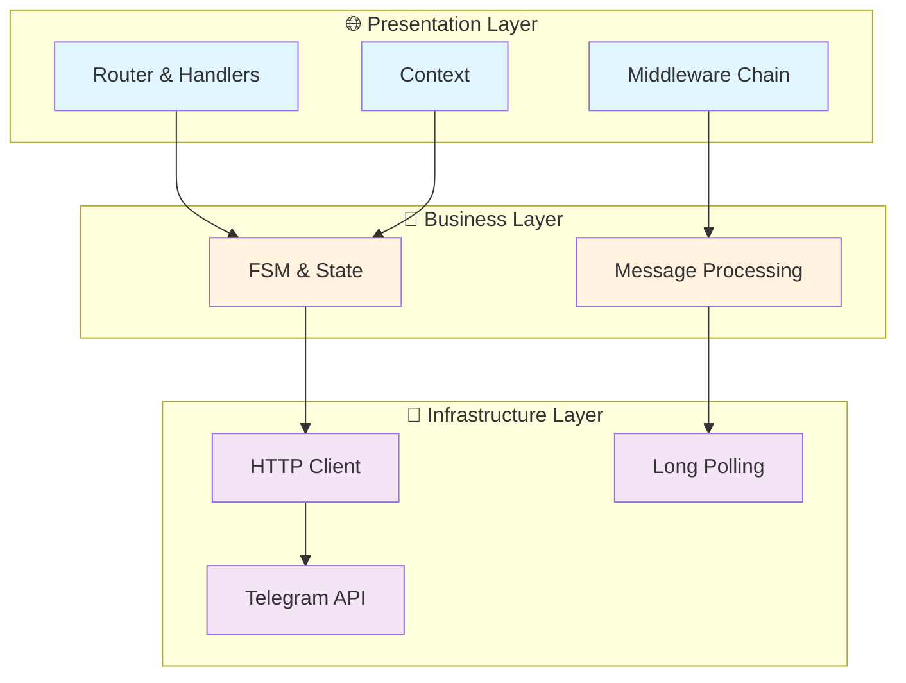

# 🤖 Gogram

**Simple Telegram Bot SDK for Go**

[](https://golang.org)
[](LICENSE)

*Clean Code • Type Safety • Easy to Use*

---

## 🎯 What is Gogram?

Gogram is a simple Telegram Bot SDK for Go that provides basic routing, state management, and message handling. It's designed to be easy to use for creating simple to moderately complex Telegram bots.

## ✨ Features

### 🔧 Core Functionality
- **Message Routing** - Commands, callbacks, regex patterns, and text matching
- **State Management** - Basic finite state machine for conversation flows
- **Middleware Chain** - Composable request processing
- **Context Handling** - Request-scoped data and operations
- **Inline Keyboards** - Simple keyboard builder for interactive messages

### 🤖 Telegram API Support
- **10 Core Endpoints** - Essential bot operations
  - SendMessage, SendPhoto, SendDocument
  - EditMessageText, DeleteMessage
  - SendChatAction, AnswerCallbackQuery
  - GetMe, GetChat, SetMyCommands
- **Long Polling** - Automatic update fetching
- **Callback Queries** - Interactive button handling

## 📦 Installation

```bash
go get github.com/AlexMayka/gogram
```

## 🚀 Quick Start

### Simple Echo Bot

```go
package main

import (
    "context"
    "os"
    
    "github.com/AlexMayka/gogram/core"
    "github.com/AlexMayka/gogram/infra/router"
    "github.com/AlexMayka/gogram/runtime"
    "github.com/AlexMayka/gogram/types/commands"
)

func main() {
    r := router.New()
    
    r.Command("/start", func(ctx core.Context) {
        ctx.Send(&commands.SendMessageRequest{
            Text: "👋 Hello! I'm a Gogram bot!",
        })
    })
    
    r.Any(func(ctx core.Context) {
        ctx.Send(&commands.SendMessageRequest{
            Text: "You said: " + ctx.Text(),
        })
    })
    
    bot := runtime.New(os.Getenv("TELEGRAM_TOKEN"), runtime.WithRouter(r))
    bot.Run(context.Background())
}
```

### Interactive Bot with Keyboards

```go
func handleStart(ctx core.Context) {
    keyboard := commands.NewKeyboard().
        Row(
            commands.Button("📊 Stats", "stats"),
            commands.Button("⚙️ Settings", "settings"),
        ).
        Build()

    ctx.Send(&commands.SendMessageRequest{
        Text:        "Choose an option:",
        ReplyMarkup: keyboard,
    })
}

func handleCallback(ctx core.Context) {
    switch ctx.CallbackData() {
    case "stats":
        ctx.Send(&commands.SendMessageRequest{
            Text: "📊 Here are your stats...",
        })
    case "settings":
        ctx.Send(&commands.SendMessageRequest{
            Text: "⚙️ Settings menu...",
        })
    }
}
```

### Conversation Flow with FSM

```go
func registerFlow() core.Router {
    r := router.New()
    
    r.Command("/register", func(ctx core.Context) {
        ctx.Send(&commands.SendMessageRequest{
            Text: "What's your name?",
        })
        ctx.FMS().Set(ctx.ChatId(), "awaiting_name")
    })
    
    nameGroup := r.Group("/name").SetState("awaiting_name")
    nameGroup.Any(func(ctx core.Context) {
        name := ctx.Text()
        ctx.FMS().SetParam(ctx.ChatId(), "name", name)
        ctx.FMS().Set(ctx.ChatId(), "awaiting_age")
        
        ctx.Send(&commands.SendMessageRequest{
            Text: fmt.Sprintf("Nice to meet you, %s! How old are you?", name),
        })
    })
    
    ageGroup := r.Group("/age").SetState("awaiting_age")
    ageGroup.Any(func(ctx core.Context) {
        name := ctx.FMS().GetParam(ctx.ChatId(), "name")
        age := ctx.Text()
        
        ctx.Send(&commands.SendMessageRequest{
            Text: fmt.Sprintf("Great! %s, %s years old. Registration complete!", name, age),
        })
        ctx.FMS().Set(ctx.ChatId(), "")
    })
    
    return r
}
```

## 🏗️ Architecture

Simple layered architecture with interface-based design:



## 🧪 Examples

| Example | Description | 
|---------|-------------|
| [**Echo Bot**](examples/echo-bot/) | Simple message echoing |
| [**Interactive Bot**](examples/interactive-bot/) | Keyboards and callbacks |
| [**Register Flow**](examples/register-flow/) | User registration with FSM |

### Running Examples

```bash
# Set your bot token
export TELEGRAM_TOKEN="your_bot_token_here"

# Run any example
go run ./examples/echo-bot/
go run ./examples/interactive-bot/
go run ./examples/register-flow/
```

## 🧪 Testing

```bash
# Run all tests
go test ./...

# Run with coverage
go test -v -coverprofile=coverage.out ./...
go tool cover -html=coverage.out

# Run specific package tests
go test -v ./core/
```

### Test Coverage
- **Core Package** - Router, Context, FSM functionality
- **26 Test Functions** - Covering main use cases
- **Mock Implementations** - For testing handlers

## 📚 API Reference

### Available Commands
- `SendMessage` - Send text messages
- `SendPhoto` - Send photos with captions
- `SendDocument` - Send files
- `EditMessageText` - Edit sent messages
- `DeleteMessage` - Delete messages
- `SendChatAction` - Show typing/uploading status
- `AnswerCallbackQuery` - Respond to button clicks
- `GetMe` - Get bot information
- `GetChat` - Get chat details
- `SetMyCommands` - Set bot command menu

### Routing Options
- `Command("/start", handler)` - Handle commands
- `Callback("data", handler)` - Handle button clicks
- `Regex("pattern", handler)` - Pattern matching
- `Text("exact text", handler)` - Exact text match
- `Any(handler)` - Catch-all handler

### State Management
- `ctx.FMS().Set(chatId, state)` - Set user state
- `ctx.FMS().Get(chatId)` - Get current state
- `ctx.FMS().SetParam(chatId, key, value)` - Store data
- `ctx.FMS().GetParam(chatId, key)` - Retrieve data

## 🔧 Configuration

```go
// Basic configuration
bot := runtime.New(
    os.Getenv("TELEGRAM_TOKEN"),
    runtime.WithRouter(router),
)

// Start with context
ctx := context.Background()
bot.Run(ctx)
```

## 📄 License

This project is licensed under the MIT License - see the [LICENSE](LICENSE) file for details.

## 🤝 Contributing

Contributions are welcome! Feel free to:
- Report bugs
- Suggest features
- Submit pull requests
- Improve documentation

## 📞 Support

- 🐛 **Bug Reports**: [GitHub Issues](https://github.com/AlexMayka/gogram/issues)
- 💬 **Discussions**: [GitHub Discussions](https://github.com/AlexMayka/gogram/discussions)

---

<div align="center">

Made with ❤️ by [Aleksey Mayka](https://github.com/AlexMayka)

</div>